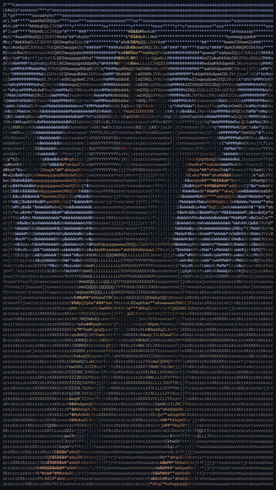

<p align="center">
  
</p>

# Soul Wars Status

A companion overlay for Soul Wars, whether you're taxiing or just playing games.

It shows a status window, either as an in-client overlay or a separate always-on-top window that
stays visible when RuneLite is minimised (handy for watching an alt). Drag the window anywhere to
move it and it remembers where you put it, and clicking it brings the game back to the front.

- whether you're in a game or out of it
- who you're following, and whether they're moving
- your HP, plus a line for when you're fighting the Avatar with its health
- your active prayers and how long your prayer will last, coloured by how much is left
- your team colour, blue or red
- zeal: tokens, session, last game, lifetime, and per hour
- how long the session has run
- run energy
- your session win/loss record, with a red/blue team breakdown
- while in a game: your captures, avatar damage, fragments sacrificed, bones buried, each team's
  avatar kills out of 5, each avatar's health and strength, the activity bar with an "Inactive in"
  countdown, and the match time left
- in the lobby: players waiting and time to the next game

Activity is green at 50% and up, red from 35 to 49%, and flashes under 35%, and the "Inactive in"
countdown follows the same colours. Low prayer and the last five minutes of a game flash too. Every
line apart from the in game / out of game header can be turned off in the settings.

The side panel opens from the toolbar button with the "Soul Wars" tooltip. It has your zeal tokens
and lifetime zeal, how many Spoils of War crates your tokens buy, a daily zeal-xp tracker against
the 1,000,000 cap with a countdown to the UTC reset, an XP per Zeal Token table showing where the
rate steps up between 30 and 99, and a zeal calculator. The calculator covers the seven trainable
skills and has both a From and a Target column, each editable and each switchable between level and
XP, filled in from your own levels.

You get a one-off in-game note when a new version ships, once per version.

The plugin is display-only. It reads your following status (it doesn't change or reorder any menu
options) and the match stats the game already shows, and it never automates anything. Values it
can't read safely show "Unknown" rather than a guess, and your token balance says "open Nomad to
sync" until it can read it.

## Building

```
./gradlew clean test build
```

or double-click `build.bat` on Windows. `run-client.bat` starts a dev RuneLite client with the
plugin loaded.
